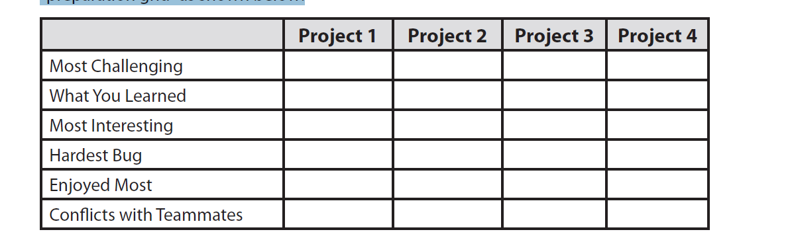
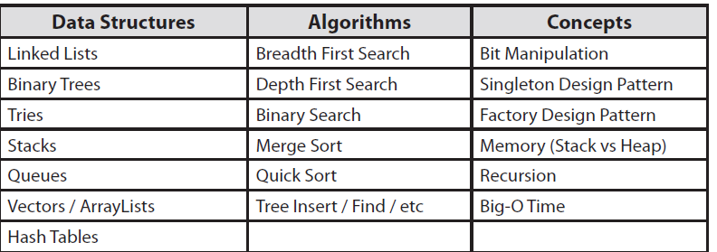

# Introduction
Sugestions:
* Write code on paper
* Know your resume
* Dont memorise solutions 
* Talk out loud while you are solving problems 
---
## Microsoft Interview
>___Definitely Prepare:___
“Why do you want to work for Microsoft?”
In this question, Microsoft wants to see that you’re passionate about technology. A great answer might be, “I’ve been using Microsoft software as long as I can remember, and I'm really impressed at how Microsoft manages to create a product that is universally excellent. For example, I’ve been using Visual Studio recently to learn game programming, and it’s APIs are excellent.” Note how this shows a passion for technology!

## Amazon Interview 
>___Definitely Prepare:___
Amazon is a web-based company, and that means they care about scale. Make sure you prepare for questions in “Large Scale.” You don’t need a background in distributed systems to answer these questions. See our recommendations in the System Design and Memory Limits Chapter.
Additionally, Amazon tends to ask a lot of questions about object oriented design. Check out the Object Oriented Design chapter for sample questions and suggestions.
## Google Interview 
>___Definitely Prepare___
As a web-based company, Google cares about how to design a scalable system. So, make sure you prepare for questions from “System Design and Memory Limits” Additionally, many Google interviewers will ask questions involving Bit Manipulation, so please brush up on these questions.

## Apple Interview 
>___Definitely Prepare___
If you know what team you’re interviewing with, make sure you read up on that product. What do you like about it? What would you improve? Offering specific recommendations can show your passion for the job.

## Yahoo Interview
> ___Definitely Prepare___
Yahoo, almost as a rule, asks questions about system design, so make sure you prepare for that. They want to know that you can not only write code, but that you can design software. Don’t worry if you don’t have a background in this - you can still reason your way through it

# Writing a Resume
* Include only relevant jobs 
* Writing strong bullet points eg, _Reduced object rendering time by 75 percent by applying Floyd's algorithm._
* Have a section dedicated to the projects (2-4 significant projects)
* Farmilarity with software eg linux and programming languages such as C++  

__Behavorial Questions Table__

## General Advice 
1. When asked about your weaknesses, give a real weakness! Answers like “My greatest weakness is that I work too hard / am a perfectionist / etc” tell your interviewer that you’re arrogant and/or won’t admit to your faults. No one wants to work with someone like that. A better answer conveys a real, legitimate weakness but emphasizes how you work to overcome it. For example: “Sometimes, I don’t have a very good attention to detail. While that’s good because it lets me execute quickly, it also means that I sometimes make careless mistakes. Because of that, I make sure to always have someone else double check my work.”

2. When asked what the most challenging part was, don’t say “I had to learn a lot of new languages and technologies.” This is the “cop out” answer (e.g., you don’t know what else to say). It tells the interviewer that nothing was really that hard.
3. Remember: you’re not just answering their questions, you’re telling them about yourself! Many people try to just answer the questions. Think more deeply about what each story communicates about you.
4. If you think you’ll be asked behavioral questions (e.g., “tell me about a challenging interaction with a team member”), you should create a Behavioral Preparation Grid. This is the same as the one above, but the left side contains things like “challenging interaction”, “failure”, “success”, and “influencing people.”

# What You Need To Know 
### Basic algorithms

# Structure using S.A.R Situation Action Response/Result
> Example: “Tell me about a challenging interaction with a teammate.”
* Situation: On my operating systems project, I was assigned to work with three other people. While two were great, the third team member didn’t contribute much. He stayed quiet during meetings, rarely chipped in during email discussions, and struggled to complete his components.
* Action: One day after class, I pulled him aside to speak about the course and then moved the discussion into talking about the project. I asked him open-ended questions on how he felt it was going, and which components he was excited about tackling. He suggested all the easiest components, and yet offered to do the write-up. I realized then that he wasn’t lazy – he was actually just really confused about the project and lacked confidence. I worked with him after that to break down the components into smaller pieces, and I made sure to complement him a lot on his work to boost his confidence.
* Result: He was still the weakest member of the team, but he got a lot better. He was able to finish all his work on time, and he contributing more in discussions. We were happy to work with him on a future project. 

# Data Structures

## Hash Tables
* know how to implement and use 

## Array List (Dynamically Resizing Array)
* It is an array that resizes itself while still providing O(1) access. The implementation is whenever the array is full the size allocated is doubled (O(n)), however the average time is still O(1) for access.

## StringBuffer/StringBuilder
* When appending strings to each other -> O(n^2) n the size of one string (we have to create a copy of the string).
* With string buffer/buidler you avoid the problem.

# Problems
> _Implement an algorithm to determine if a string has all unique characters. What if you can not use additional data structures?_
> * Implement a hash table 
> * If the data structures are not allowed -> add the  
